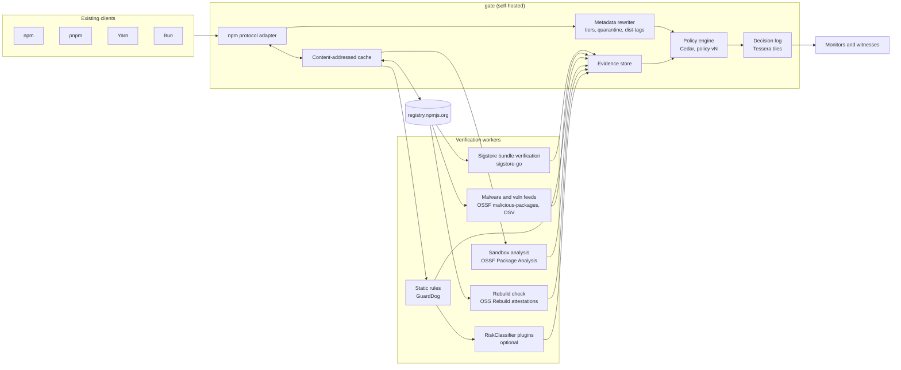
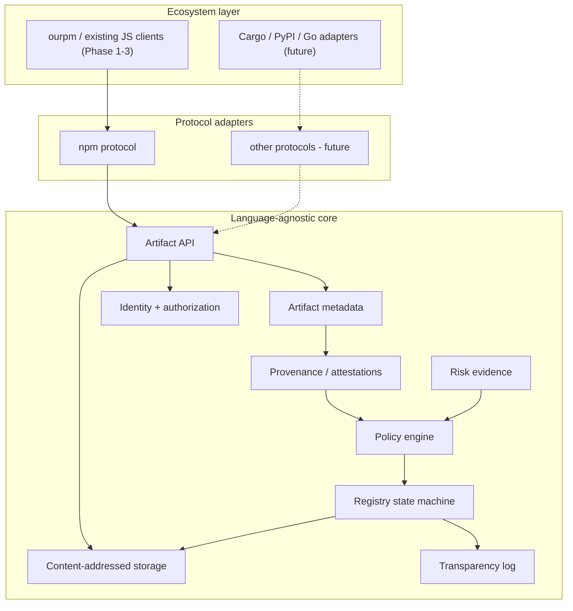

# Implementation plan: open, verifiable package trust infrastructure (npm first)

**Version:** v1 · 2026-09-25
**Status:** superseded where [REVIEW.md](REVIEW.md) §12 decides otherwise: TypeScript instead of Go, CEL instead of Cedar, quarantine timed from the upstream publish time instead of `firstSeenAt`, and `gate verify` before the proxy.
**Working names:** `gate` (verifying proxy + decision log), `ourpm` (client, name from the ChatGPT conversation)

> **About "update the initial plan":** No initial plan exists to update. ChatGPT never rendered the "full plan" or the "tech-stack comparison". Its last turn says so, and it only provided an architecture amendment. This document is therefore the first complete plan. Where the conversation already made a decision, this plan keeps it, and each one is listed in §1. Where research showed a decision was wrong or premature, the change is marked **[changed]** with the reason.
>
> *Opinion* marks my own judgment. Everything else is sourced (see §16).

---

## 0. One-sentence strategy

Build the trust layer first as a **self-hostable verifying proxy in front of npm**. It enforces a versioned, verifiable policy and records every decision in a transparency log. It becomes a full publishing registry (and later a multi-ecosystem one) only once adoption and funding justify it.

---

## 1. Decisions carried over from the conversation

| # | Decision (conversation) | Status in this plan |
|---|---|---|
| D1 | Integrity ≠ authenticity; require source → CI → artifact provenance | ✅ Kept, but provenance is treated as *pipeline identity, not safety* **[changed]**: valid-provenance malware shipped in 2026 (TanStack, ChainDrop) |
| D2 | Layered defenses: provenance policy, malware scan, release quarantine, client re-verification | ✅ Kept |
| D3 | Transparency log so the operator can't rewrite history | ✅ Kept, now a log of **gate decisions**, built on Tessera tiles |
| D4 | Formal verification only for small pure parts: state machine, publish authorization, dependency-graph acceptance | ✅ Kept |
| D5 | Bend 2 as proof checker | **[changed]** → Cedar (policy) + Lean 4 or Dafny (state-machine spec), with the checker kept pluggable. Bend has open soundness bugs (#1001) and an unaudited compiler |
| D6 | Ecosystem-defined, versioned canonical laws (`SupplyChainPolicy/vN`); publishers can't write their own | ✅ Kept |
| D7 | ML classifiers produce **claims with probabilities, never facts**; they can't override hard constraints | ✅ Kept |
| D8 | Generic `RiskClassifier → Claim[]` interface; Jev is optional | ✅ Kept. The default backends are open tools **[changed]**: Jev is hosted-only, US-based, with no security benchmark |
| D9 | Publish decisions/evidence for auditability, coarsened to avoid feeding attackers | ✅ Kept |
| D10 | Language-agnostic **artifact** core; ecosystem-specific resolution; npm first; no Cargo/PyPI/Go yet | ✅ Kept |
| D11 | `Artifact` envelope with typed `ecosystemMetadata` | ✅ Kept (§5.1) |
| D12 | `VerifiedGraph` / Verified Graph Certificate before install | ✅ Kept (§7.4) |
| D13 | v1 promise: complete open-source npm registry + client | **[changed]** → v1 is a verifying proxy plus client verification; the full registry is Phase 3 (see §0 and the final decision) |

---

## 2. Goals and non-goals

**Goals**
1. **Open:** OSI-licensed end to end (Apache-2.0), self-hostable, no single-vendor control. Both vlt's registry (FSL) and pnpm's pnpr (PolyForm Shield) fall short here.
2. **Verifiable:** every accept/quarantine/reject decision is reproducible from logged inputs, policy hash and evidence.
3. **Drop-in:** works with the npm, pnpm, Yarn and Bun clients people already use before `ourpm` exists.
4. **Privacy-respecting by default** (§10).
5. **Language-agnostic core** that doesn't bake in npm semantics.

**Non-goals (for now)**
- Replacing npmjs.org as the public source of truth.
- Supporting Cargo, PyPI or Go (the boundaries exist; the adapters are not built).
- Writing a new dependency resolver from scratch, or a new transparency-log protocol.
- Any ML output that can bypass a hard constraint.

---

## 3. Threat model (drives every control)

| Attack class | Real example | Primary control | Secondary control |
|---|---|---|---|
| Maintainer account takeover (phishing) | chalk/debug, 2025-09-08 | Quarantine window + trust-downgrade rule ("had provenance, now doesn't") | Behavioral diff vs previous version |
| Stolen long-lived publish token | Nx s1ngularity (NPM_TOKEN), 2025-08 | Require provenance for packages that previously had it | Quarantine |
| Compromised CI / valid provenance | TanStack (SLSA L3), 2026-05; ChainDrop, 2026-08 | Workflow-hygiene policy + independent rebuild for high-impact packages | Sandbox behavioral analysis |
| Actions cache poisoning | Ultralytics, 2024-12 | Policy: no cache in release workflow (where detectable), rebuild match | Behavioral diff |
| Self-propagating worm | Shai-Hulud 1/2, 2025 | Quarantine + install scripts blocked by default | Malware feeds |
| Typosquat / impersonation | 454k malicious packages in 2025 | Name-similarity rules + OSSF malicious-packages feed | Classifier claim → quarantine |
| Dependency confusion | Birsan 2021 | Namespace pinning: private scopes never resolve upstream | Graph check |
| Malicious/compromised registry or mirror | (design threat) | Client verifies Sigstore bundles itself; gate decisions logged | Log monitors and witnesses |
| Operator rewrites history | (design threat) | Append-only Tessera log + witness cosignatures | Public checkpoints |
| Prompt injection against AI scanners | `shai_hulululud`, 2026-06 | Classifiers get extracted features, not raw source; advisory only | Size caps |

Sources for the incidents are in §16. Every row becomes a **replay test** in the evaluation suite (§12).

---

## 4. Architecture

### 4.1 Phase 1–2 deployment (verifying proxy)



### 4.2 Target architecture (Phase 3+), unchanged from the conversation's amendment



Dependency resolution stays in the ecosystem layer: npm adapter → npm resolution → candidate graph → generic policy → Verified Graph Certificate → installer (per the conversation).

---

## 5. Data model

### 5.1 Artifact envelope (from the conversation, extended)

```text
Artifact {
  digest              // sha512 (npm integrity) + sha256
  mediaType
  size
  ecosystem           // "npm"
  ecosystemMetadata   // NpmMetadata (typed, adapter-owned)
  publisherIdentity?  // from Sigstore cert (workload identity preferred)
  provenance[]        // Sigstore bundles (SLSA v1 predicate)
  attestations[]      // rebuild, scan, other in-toto statements
  riskEvidence[]      // Claim[]
  trustTier           // see 5.4
  firstSeenAt         // gate's own clock, used for quarantine
}
```

### 5.2 Claim (classifier/scanner output, never a fact)

```text
Claim {
  kind          // "malware-feed-match" | "behavior-drift" | "unexpected-capability" | ...
  value
  probability?  // present only for probabilistic sources
  source        // "ossf-malicious-packages@<rev>" | "guarddog@<ver>" | "jev-1.13.0" ...
  evidenceHash
  createdAt
}
```

### 5.3 Decision record (what goes in the transparency log)

```text
Decision {
  artifactDigest, ecosystem, name, version
  policyId: "SupplyChainPolicy/v1", policyHash
  inputsHash            // hash of the exact evidence set evaluated
  outcome: ACCEPT | QUARANTINE(until) | REJECT
  reasons[]             // coarse codes; details are released after a delay (D9)
  gateInstance, timestamp
}
```

### 5.4 Trust tiers for upstream packages (new: the bootstrap problem)

Only about 25% of npm download volume uses trusted publishing, so most packages have no provenance and tiers are unavoidable:

| Tier | Meaning |
|---|---|
| `T3 rebuilt` | Valid provenance **and** an independent rebuild match (OSS Rebuild or our own) |
| `T2 provenance` | Valid Sigstore/SLSA provenance, identity matches the package's history |
| `T1 legacy` | No provenance, clean feeds and scans, older than the quarantine window |
| `T0 blocked` | Feed match, reject rule, or unresolved high-risk claim |

Projects choose the minimum tier in their policy, e.g. `T2 for new deps, T1 allowed for existing lockfile entries`.

---

## 6. Policy (replaces Bend in the trust path)

- **Language: Cedar.** Its Lean-verified spec covers default deny, forbid-over-permit and order independence, and its symbolic analysis can prove things like "policy v2 is never more permissive than v1". Evaluation in the service uses **cedar-go**. Schema validation and symbolic analysis run in CI with Rust Cedar (`cedar-policy-symcc`), because cedar-go doesn't yet include the validator.
- **Versioned canonical policy** (D6): `SupplyChainPolicy/v1` is published as an artifact with a hash. Every decision references it. Organizations can only **add restrictions** on top of it, never loosen it.
- **Example v1 rules** (described in prose; the Cedar is written in M0):
  - forbid if a malware-feed claim exists
  - forbid if `trustTier < project.minTier`
  - quarantine if `now - firstSeenAt < quarantineWindow` (default 72h *Opinion*, tunable)
  - quarantine if the package previously had provenance and this version doesn't (trust downgrade, same idea as pnpm `trustPolicy: no-downgrade`)
  - quarantine if the provenance workflow or repo differs from previous versions
  - quarantine if a new install script appears, or if sandbox analysis shows new network/credential access vs the previous version
  - probabilistic claims can only move `ACCEPT → QUARANTINE`, never `REJECT → ACCEPT` (D7)
- **Formal spec of the state machine** (D4), in Lean 4 or Dafny, for the invariants from the conversation:
  - a revoked artifact never becomes active again
  - an existing version's digest never changes
  - provenance is immutable
  - a namespace transfer requires threshold authorization
  - a deleted name stays tombstoned

  This matters from Phase 3 (publishing). In Phase 1 the spec is written but only the decision rules run. Keep the checker pluggable, as in the conversation's "same acceptance semantics" diagram. Bend can be re-evaluated later.

---

## 7. Component specs

### 7.1 npm protocol adapter
- Serves packuments (full and abbreviated `application/vnd.npm.install-v1+json`), tarballs, dist-tags, and `/-/npm/v1/keys`.
- **Rewrites metadata to hide quarantined or blocked versions** and repoints `latest`. The same technique as foxymirror, which returns HTTP 451 for quarantined versions.
- Proxies `/-/npm/v1/attestations/{pkg}@{ver}` so clients can verify provenance themselves.
- Lockfile compatibility: document the `replace-registry-host` setup for npm. pnpm and Yarn use their own registry config.
- **Namespace pinning:** configured private scopes never fall through to upstream (dependency-confusion protection).

### 7.2 Verification workers
- **Provenance:** fetch the Sigstore bundle via the npm attestations endpoint and verify with **sigstore-go** (stable; passes the Sigstore conformance suite). Check the certificate identity (repo + workflow path + OIDC issuer) against the package's history. Don't use sigstore-rs: it is pre-1.0 and doesn't verify attestations yet.
- **Feeds:** OSSF malicious-packages (OSV format) + OSV vulnerabilities, synced locally.
- **Static:** GuardDog (Apache-2.0, npm support, JSON/SARIF output).
- **Dynamic:** OSSF Package Analysis (gVisor sandbox; records files, network, commands). Run it on upgrades of packages already in use, not on the whole registry.
- **Rebuild:** consume OSS Rebuild attestations where they exist; run our own rebuilds only for an allowlist of high-impact packages (Phase 2).
- **RiskClassifier plugins (optional):** the interface from the conversation. Inputs are **extracted features and diffs only**, with capped size. Default backend: none. Allowed backends: a self-hosted logit classifier (simple-jev style), or Jev if the operator accepts sending features to a US third party.

### 7.3 Decision log
- **Tessera** (Go, Apache-2.0, tlog-tiles, production-ready since beta) with a POSIX or S3-style backend.
- Witness cosignatures via the C2SP witness protocol.
- Publish checkpoints. Ship a monitor that alerts package owners and orgs when a decision about their packages appears (the rekor-monitor idea, applied to gate decisions).

### 7.4 Client-side verification (the conversation's VerifiedGraph)
- **Phase 2 deliverable: `gate verify`.** It reads the lockfile, re-fetches bundles and decision records, re-evaluates the pinned policy locally, and emits a **Verified Graph Certificate**: the lockfile hash, policy hash, per-node decision references and the result. Installs are gated on it in CI.
- Integrations with existing clients:
  - **pnpm:** `afterAllResolved` hook to run the check on the resolved lockfile.
  - **Bun:** Security Scanner API (fatal/warn levels).
  - **npm:** a CI step, plus `npm audit signatures`.
- The resolver is untrusted and the checker is small ("untrusted solver, trusted checker"). If `ourpm` is built (Phase 3), reuse PubGrub or resolvo; don't write a resolver.

### 7.5 Identity (Phase 3 publishing)
- OIDC trusted publishing only. Support GitHub, GitLab **and self-hosted/SPIFFE workload identities**; npm today supports only three hosted providers.
- Revocation and distrust are first-class state-machine events, logged. Sigstore has no certificate revocation.
- Staged release with multi-party approval for packages flagged high-impact.

---

## 8. Tech stack

| Layer | Choice | Why | Main trade-off |
|---|---|---|---|
| Service language | **Go** | sigstore-go (stable), Tessera, OSSF Package Analysis and OSV tooling are all Go | Cedar's most complete implementation is Rust; cedar-go lacks the validator |
| Policy | Cedar (cedar-go runtime, Rust Cedar in CI) | Formally specified, analyzable | Authorization-shaped; graph rules are expressed as facts computed in Go |
| Formal spec | Lean 4 or Dafny | Mature kernels; Dafny can compile to Go | Proof effort; limited to the state machine |
| Sigstore | sigstore-go | Stable, conformance-tested | — |
| Log | Tessera + witnesses | tlog-tiles, same model as Rekor v2 | Must run and monitor it |
| Metadata DB | PostgreSQL | Proven (JSR uses Postgres) | — |
| Blob storage | S3-compatible (MinIO self-hosted, R2/S3 hosted) | Content-addressed tarballs | Egress cost for a public instance |
| Scanners | GuardDog, Package Analysis, OSSF feed, OSV | Open, maintained | Sandbox compute cost; false positives |
| Rebuilds | OSS Rebuild attestations | Existing npm coverage | Coverage isn't universal |
| Deploy | Single binary + Docker Compose; Helm later | Self-hosting is the product | — |

*Opinion:* Go is the pragmatic choice because the security primitives already exist there. If the team prefers Rust (as JSR and pnpr do), the cost is weaker Sigstore attestation support today.

---

## 9. Phased roadmap with exit criteria

| Phase | Scope | Exit criteria |
|---|---|---|
| **M0: Specs** | Threat model (§3), `SupplyChainPolicy/v1` in Cedar, decision-record and certificate formats, privacy policy, license (Apache-2.0), governance draft | Specs reviewed externally; replay corpus of 2025–2026 incidents assembled |
| **M1: Read-only gate** | npm adapter, caching proxy, quarantine by `firstSeenAt`, feeds, provenance verification, trust tiers, namespace pinning, decision log (no witnesses yet) | Works as the registry for npm, pnpm, Yarn and Bun on real projects; every replayed incident version is quarantined or blocked *before* its known takedown time; zero hash mismatches vs upstream |
| **M2: Evidence and client verification** | GuardDog + Package Analysis on upgrades, OSS Rebuild consumption, `gate verify` + Verified Graph Certificate, pnpm/Bun integrations, witnesses and monitor | False-positive rate measured on the top N packages' last 12 months of releases and published; CI gating in at least one real org |
| **M3: Publishing registry** | First-party namespace, OIDC publishing incl. self-hosted identities, staged + multi-party release, state machine with a formally specified spec, `ourpm` client (reusing PubGrub/resolvo) | External security audit; spec invariants covered by proof or model-checking; published abuse/takedown and name-dispute policy |
| **M4: Other ecosystems** | Cargo or PyPI adapter on the same core | Only if M1–M3 have adoption and funding |

No calendar dates are given: they depend on team size, which isn't known.

---

## 10. Privacy

- **No client telemetry headers are needed or stored.** The gate ignores `npm-session`, `npm-command` and `npm-scope` and never logs them.
- **Access logs:** IP truncated, retained for at most 30 days (Go's module proxy commits to 30 days for PII).
- **Advisory matching is local:** the gate and `gate verify` sync feeds; lockfiles are never uploaded.
- **Download counts:** aggregate only, with no user or IP field (Homebrew's model).
- **Signer identity:** prefer workload identity (repo + workflow) over personal email. Personal emails in Sigstore certificates are permanent in Rekor, so the Phase 3 publishing docs must warn maintainers and default to CI identities.
- The **decision log** contains package facts and policy outcomes, never consumer data.

---

## 11. Governance, license, funding, operations

- **License:** Apache-2.0 for everything, deliberately unlike FSL (vlt VSR) and PolyForm Shield (pnpr).
- **Governance:** a public RFC process for policy versions. Aim for a neutral foundation home before running a *public* instance. JSR's board is a reference model.
- **Funding:** self-hosted gate first, so there are no public bandwidth costs. A public instance requires a CDN/cloud sponsor first; PyPI and crates.io run on donated capacity.
- **Operations for any public instance:**
  - malware takedown SLA
  - quarantine review queue (PyPI restored only 1 of ~140 quarantined projects)
  - false-positive appeal path
  - DMCA and sanctions policy
  - name-dispute policy (lessons from left-pad/kik)

---

## 12. Evaluation and success metrics

- **Replay suite:** for each incident in §3, the time from publish to gate block vs the time to upstream takedown.
- **False-positive rate** on benign releases of the top packages (published per policy version).
- **Coverage:** % of installed nodes by trust tier; % of installs passing `gate verify`.
- **Latency overhead** vs direct npm (cached and uncached).
- **Log health:** witness cosignature freshness, monitor alert delivery.

---

## 13. Build vs reuse

| Existing | Use how |
|---|---|
| vlt VSR (FSL-1.1-MIT) | Study only; license is incompatible with goal 1 |
| pnpr (PolyForm Shield) | Study its adapter boundaries and server-side resolution; don't copy code |
| JSR (MIT) | Reference for provenance UX and infrastructure (Rust API, Postgres, Cloudflare) |
| Verdaccio (MIT) | Candidate base for M1's proxy layer *if* its plugin API can host the rewrite and policy hooks (to evaluate in M0) |
| foxymirror (MIT) | Reference implementation of metadata-level quarantine |
| OSS Rebuild, Package Analysis, GuardDog, OSSF feeds, sigstore-go, Tessera, Cedar | Direct dependencies |

---

## 14. Open decisions (need your input)

1. Base M1 on Verdaccio plugins, or build a small Go proxy from scratch?
2. Default quarantine window: 24h (pnpm 11's default), 72h, or 7 days (foxymirror's default)?
3. Lean 4 or Dafny for the state-machine spec?
4. Whether any hosted classifier (Jev) is acceptable, given it sends features to a third party.
5. Project name and whether to pursue a foundation early.

---

## 15. Risks

- **npm keeps closing gaps.** It has shipped staged publishing, v12 scripts-off and publish-time scanning. The durable differentiators are openness, transparency, verifiable policy and self-hosting, not features.
- **False positives** can kill adoption. Amalfi's decision tree logged 1,017 false positives against 78 true positives in one week.
- **Low provenance coverage** upstream means most traffic stays `T1` for a long time.
- **Scope creep** into multi-ecosystem work, which the conversation already warned about.
- **Operating a log** without monitors and witnesses gives little real assurance.

---

## 16. Sources

**Conversation-derived projects**
- vlt: https://github.com/vltpkg/vltpkg · VSR: https://github.com/vltpkg/vsr · vlt 1.0: https://www.vlt.io/blog/1-0
- pnpr: https://pnpm.io/pnpr/ · foxymirror: https://github.com/FenkoHQ/foxymirror · JSR: https://github.com/jsr-io/jsr · Verdaccio: https://github.com/verdaccio/verdaccio
- Bend: https://github.com/bendlang/bend · issue #1001: https://github.com/bendlang/bend/issues/1001
- Jev: https://docs.typesafe.ai/models.md · Parallel test: https://parallel.ai/blog/testing-jev · simple-jev: https://github.com/featherless-ai/simple-jev

**npm state**
- Trusted publishing GA: https://github.blog/changelog/2025-07-31-npm-trusted-publishing-with-oidc-is-generally-available/
- Trusted publishers (providers): https://docs.npmjs.com/trusted-publishers/
- Staged publishing: https://github.blog/changelog/2026-05-22-staged-publishing-and-new-install-time-controls-for-npm/
- v12 defaults: https://github.blog/changelog/2026-07-08-npm-install-time-security-and-gat-bypass2fa-deprecation/
- Publish-time scanning: https://github.blog/changelog/2026-07-28-npm-publish-time-malware-scanning-and-dual-use-metadata/
- Attestations endpoint and cosign verification: https://blog.sigstore.dev/cosign-verify-bundles/
- Registry signatures and keys: https://docs.npmjs.com/verifying-registry-signatures/
- Config (`replace-registry-host`): https://docs.npmjs.com/cli/v11/using-npm/config/
- Privacy policy: https://docs.npmjs.com/policies/privacy/

**Incidents**
- chalk/debug: https://www.wiz.io/blog/widespread-npm-supply-chain-attack-breaking-down-impact-scope-across-debug-chalk
- Nx: https://nx.dev/blog/s1ngularity-postmortem
- Ultralytics: https://blog.pypi.org/posts/2024-12-11-ultralytics-attack-analysis/
- TanStack and 2026 overview: https://unit42.paloaltonetworks.com/monitoring-npm-supply-chain-attacks/
- ChainDrop: https://www.microsoft.com/en-us/security/blog/2026/08/04/chaindrop-supply-chain-compromise-anatomy-self-propagating-worm/
- Shai-Hulud: https://github.blog/security/supply-chain-security/our-plan-for-a-more-secure-npm-supply-chain/
- Prompt injection vs scanners: https://socket.dev/blog/npm-package-uses-prompt-injection-and-token-flooding-to-disrupt-ai-malware-scanners
- Dependency confusion: https://medium.com/@alex.birsan/dependency-confusion-4a5d60fec610
- Malware volume: https://www.sonatype.com/state-of-the-software-supply-chain/2026/open-source-malware
- Provenance coverage: https://www.aikido.dev/blog/shai-hulud-trusted-publishing

**Building blocks**
- sigstore-go: https://github.com/sigstore/sigstore-go · sigstore-rs limits: https://github.com/sigstore/sigstore-rs
- Sigstore security model: https://docs.sigstore.dev/about/security/ · cosign privacy notice: https://raw.githubusercontent.com/sigstore/cosign/main/cmd/cosign/cli/sign/privacy/privacy.go
- Tessera: https://github.com/transparency-dev/tessera · Rekor v2: https://blog.sigstore.dev/rekor-v2-ga/
- Cedar spec: https://github.com/cedar-policy/cedar-spec · cedar-go: https://github.com/cedar-policy/cedar-go
- Dafny: https://dafny.org/latest/DafnyRef/DafnyRef
- GuardDog: https://github.com/DataDog/guarddog · Package Analysis: https://github.com/ossf/package-analysis · malicious-packages: https://github.com/ossf/malicious-packages · OSS Rebuild: https://github.com/google/oss-rebuild
- PubGrub: https://github.com/pubgrub-rs/pubgrub · resolvo: https://github.com/prefix-dev/resolvo
- pnpmfile hooks: https://pnpm.io/pnpmfile · pnpm 11: https://pnpm.io/blog/releases/11.0 · pnpm trustPolicy: https://pnpm.io/settings/dependency-resolution
- Bun security scanner: https://bun.com/docs/pm/security-scanner-api
- Amalfi: https://arxiv.org/pdf/2202.13953

**Privacy, governance, operations**
- Go proxy privacy: https://proxy.golang.org/privacy · Homebrew analytics: https://docs.brew.sh/Analytics
- PyPI quarantine: https://blog.pypi.org/posts/2024-12-30-quarantine/ · PSF funding: https://pyfound.blogspot.com/2025/10/open-infrastructure-is-not-free-pypi.html
- JSR governance: https://deno.com/blog/jsr-open-governance-board · left-pad/kik: https://blog.npmjs.org/post/141577284765/kik-left-pad-and-npm
