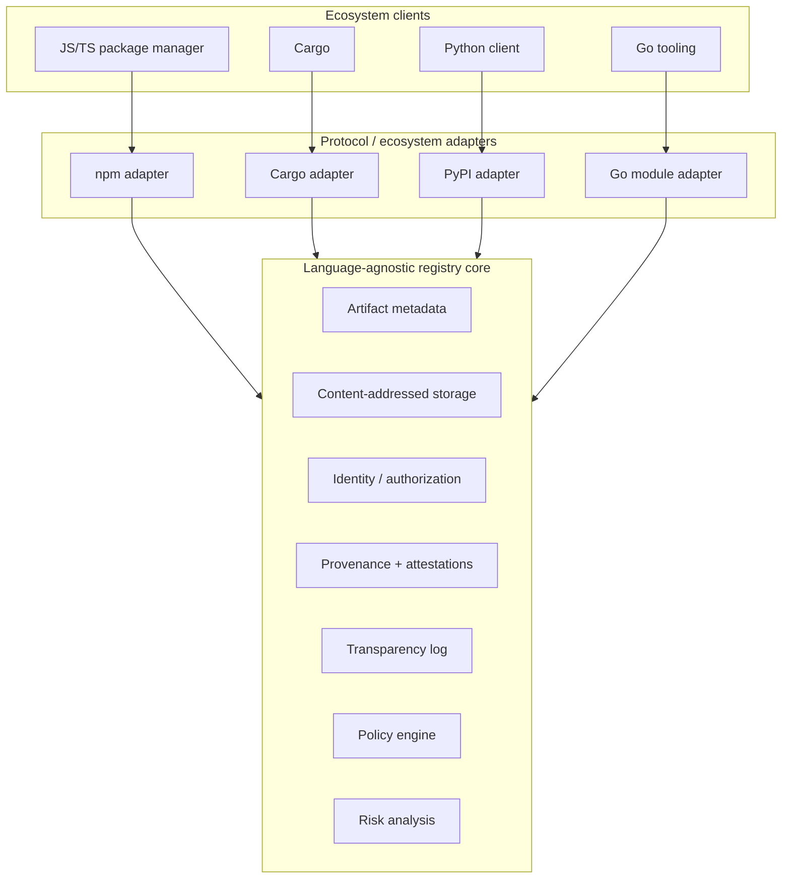
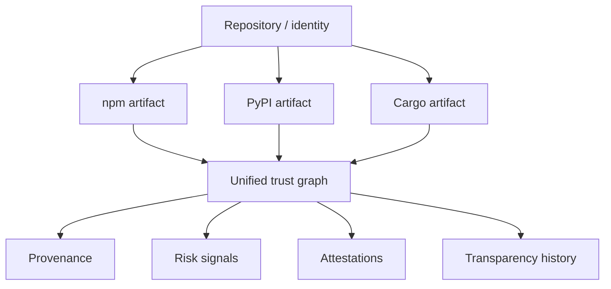
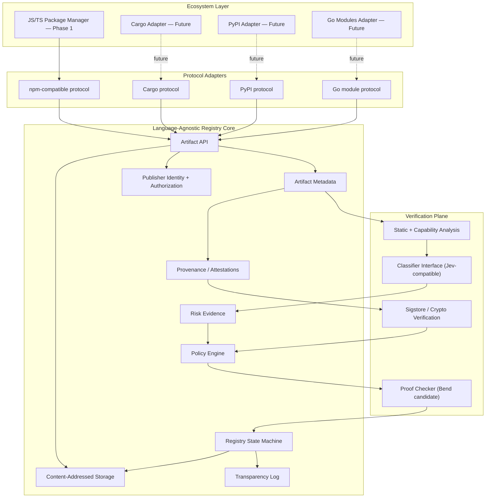

# ChatGPT conversation: Open source npm alternatives

> **Source:** ChatGPT conversation "Open source npm alternatives" (`chatgpt.com/c/6ab5fb99-ff80-83e9-bf5d-5d7b89769907`)
> **Exported:** 2026-09-25
>
> **Export notes**
> - Complete conversation: 9 user messages, starting "Today 1:45 AM". ChatGPT only keeps a few turns in the page at once, so it was captured by scrolling through the whole thread.
> - The first message was sent with ChatGPT's web search toggle on (the chip label "검색", Korean for "Search").
> - Two user prompts ("plan a full open-source alternative…" and "perform a quick tech stack…") received **no visible ChatGPT response**. ChatGPT itself later confirms "the earlier full plan never actually rendered".
> - ChatGPT rendered four diagrams as Mermaid. The Mermaid sources below were rebuilt from the rendered diagrams' nodes and edges, so labels and connections match but styling may differ.
> - Inline citation chips ("GitHub", "bend2.dev +1", …) are kept as links to the URL they pointed to.
>
> **Caution (added when saved):** ChatGPT output, not verified. Treat product names, versions and dates as claims until checked against the linked source. See `../REVIEW.md`.

---

*Today 1:45 AM*

## 🧑 User

`[검색 / Search]` check if there is an existing open-source alternative to npm (both registry, package manager) that is actively maintained and that tries to solves the supply chain issues that have been occurring more frequently.

## 🤖 ChatGPT

There is, but not yet a single mature project that cleanly replaces **both npm CLI + npmjs.org** while making supply-chain security its central design. The closest options are:

| Project | Package manager | Registry | Supply-chain approach | State |
| --- | --- | --- | --- | --- |
| pnpm + pnpr | ✅ pnpm | ✅ pnpr | Strong, increasingly security-first | Closest match; pnpr alpha |
| JSR | ❌ uses npm/pnpm/Deno/etc. | ✅ | SLSA provenance + Sigstore + OIDC | Mature registry alternative |
| Verdaccio + pnpm | ✅ pnpm | ✅ self-hosted Verdaccio | isolation, permissions, controlled upstream | Mature, but security is largely policy/config |
| Socket ecosystem | wraps existing PMs | partial/curated | malware detection, install blocking | Security layer, not true npm replacement |

### Most interesting: pnpm + pnpr

This is considerably closer to what you're describing than I expected.

[pnpm](https://pnpm.io/) is open source and extremely active: **pnpm 12.6.0 was released September 22, 2026**. The project has been explicitly adding supply-chain defenses rather than treating security as an external scanner. [GitHub+1](https://github.com/pnpm/pnpm/releases)

Recent pnpm defaults/features include:

- `minimumReleaseAge` — newly published versions are withheld for a period; pnpm 11 defaults this to **24 hours**. This directly mitigates the common pattern where a compromised maintainer publishes malware and it gets discovered/removed hours later. [GitHub+1](https://github.com/pnpm/pnpm.io/blob/main/docs/supply-chain-security.md)
- `trustPolicy` — prevents installation when a package's trust level drops, e.g. a package previously using trusted publishing suddenly publishes without equivalent trust evidence. [GitHub](https://github.com/pnpm/pnpm.io/blob/main/docs/supply-chain-security.md)
- `blockExoticSubdeps` — enabled by default in pnpm 11, restricting unusual dependency sources. [GitHub](https://github.com/pnpm/pnpm.io/blob/main/blog/releases/11.0.md)
- explicit control over which dependencies may execute build/install scripts.
- SBOM generation.
- native publishing rather than delegating critical operations back to npm. [GitHub](https://github.com/pnpm/pnpm.io/blob/main/blog/releases/11.0.md)

More interestingly, the pnpm repo now contains **pnpr**, an open-source registry server being developed alongside the package manager. Its September releases describe an npm registry plus Cargo/Python/OCI support, upstream proxying with checksum verification and OIDC authentication. It's currently **0.1 alpha**, so I wouldn't treat it as a production npmjs.org replacement yet. [GitHub+1](https://github.com/pnpm/pnpm/releases)

That makes the emerging architecture essentially:

```text
             pnpm
               │
      supply-chain policies
               │
              pnpr
          ┌────┼─────┐
          │    │     │
         npm  PyPI crates.io
```

This is probably the project I'd watch most closely for your exact question.

### JSR takes a different—and interesting—approach

[JSR](https://jsr.io/) is an MIT-licensed, fully open-source JavaScript/TypeScript registry intended as an alternative to npmjs.org. Its registry implementation itself is public. [JSR+1](https://jsr.io/docs/faq)

Its supply-chain model is stronger than simply storing hashes. GitHub Actions publishing can use **OIDC/tokenless authentication**, and JSR automatically generates **SLSA provenance statements stored in Sigstore's Rekor transparency log**. Consequently you can establish a cryptographic relationship between source repository → CI build → published package. [JSR+1](https://jsr.io/docs/trust)

That's addressing one of the fundamental npm problems: possession of a long-lived publishing credential shouldn't automatically mean *"you may publish arbitrary code as this maintainer."*

There is an important limitation, though. JSR explicitly says it **isn't a package manager**. npm, pnpm, Yarn, Deno, etc. consume packages from it. [JSR](https://jsr.io/docs/faq)

Also, its security story isn't finished: JSR's docs say signatures over uploaded manifests and its npm-compatibility tarballs remain planned rather than implemented. [JSR](https://jsr.io/docs/trust)

### Verdaccio solves a different part of the problem

[Verdaccio](https://verdaccio.org/) is the established open-source npm-compatible registry. It's very actively maintained—6.10.4 was published only days ago. [npm](https://www.npmjs.com/package/verdaccio)

You can put it between developers/CI and npm:

```text
developers / CI
       │
      pnpm
       │
   Verdaccio
       │
       └──── controlled proxy ──── npmjs.org
```

That lets an organization freeze/cache dependencies, prevent dependency confusion by disabling upstream proxying for private namespaces, restrict publishing/access, and introduce a staging/approval boundary between developers and release managers. [Verdaccio+1](https://www.verdaccio.org/docs/best/)

But Verdaccio isn't fundamentally a "malicious open-source dependency" solution. If your configured upstream serves malicious `foo@1.4.7`, Verdaccio isn't inherently going to determine that the package is malicious. Its main security advantage is **control over the trust boundary**.

### One project worth separating from the others: Socket

[Socket](https://socket.dev/) is specifically targeting npm-style supply-chain attacks. Its tooling examines packages for malicious behavior and can block packages during installation. [Socket](https://socket.dev/)

There's also an MIT-licensed `@socketregistry` repository containing curated drop-in replacements for packages, including versions intended to remove vulnerabilities/dependencies. [GitHub](https://github.com/SocketDev/socket-registry)

But this isn't an independent open-source npm ecosystem in the sense you're asking about. It's better understood as a **security layer around npm/pnpm/Yarn and existing registries**.

---

So the interesting finding is that the answer isn't really "there's an npm-but-secure project."

The ecosystem appears to be converging toward something more composable:

```text
              provenance
             Sigstore/SLSA
                  │
                  ▼
source ──► CI ──► registry
                  │
            trust metadata
                  │
                  ▼
               pnpm
          ┌───────┴───────┐
     release delay    trust policy
     script policy    lockfile
          │
          ▼
      application
```

[Sigstore](https://docs.sigstore.dev/) itself is explicitly designed for this model: signing/verifying artifacts with ephemeral keys and recording signing events in a tamper-resistant transparency log. Its roadmap specifically identifies open-source package managers as primary stakeholders. [Sigstore+1](https://docs.sigstore.dev/)

**For an existing production Node project today**, the practical open-source stack I'd investigate is **pnpm + a controlled Verdaccio registry/proxy**, with Sigstore/SLSA provenance where available. **For a greenfield ecosystem**, JSR has the cleaner provenance model. And **pnpm + pnpr** is the closest thing I found to an actively developed, open-source replacement of the *entire* npm stack—but the registry side is still too young to call mature.

Sources: [pnpm releases](https://github.com/pnpm/pnpm/releases) · [pnpm supply-chain security docs](https://github.com/pnpm/pnpm.io/blob/main/docs/supply-chain-security.md) · [JSR provenance docs](https://jsr.io/docs/trust) · [JSR source code](https://github.com/jsr-io/jsr) · [Verdaccio security guidance](https://www.verdaccio.org/docs/best/) · [Sigstore documentation](https://docs.sigstore.dev/)

---

## 🧑 User

pnpm doesnt have its own registry. it doesnt satisfy what i asked

## 🤖 ChatGPT

You're right on the factual point: **pnpm is a package manager, not a registry**, so pnpm by itself does not satisfy your requirement. My previous answer conflated a secure client with a full npm replacement. [GitHub](https://github.com/pnpm/pnpm.io/blob/main/docs/supply-chain-security.md)

A better match exists, though: **vlt**.

### [vlt](https://www.vlt.sh/)

vlt is explicitly building **both sides**:

```text
npm ecosystem                 vlt ecosystem

npm CLI          ───────►     vlt package manager
registry.npmjs.org ─────►     vlt registry / vlt.io
```

Its documentation describes vlt.io as a **drop-in replacement for the npm registry**, while the vlt CLI replaces the package-management side. [vlt /vōlt/](https://docs.vlt.sh/)

More importantly for your question, supply-chain security is one of the project's core motivations rather than an add-on. vlt 1.0, released this month, includes phased installs designed so dependency code doesn't automatically execute during installation, dependency-graph inspection/querying, and registry-side malware blocking. Its hosted registries and ecosystem mirrors also reached general availability with 1.0. [InfoQ](https://www.infoq.com/news/2026/09/vlt-npm-replacement/)

So this is much closer to what you asked for:

**open source + package manager + independent registry + npm compatibility + active development + supply-chain-security focus.**

There is one distinction worth investigating before calling it *the* answer: **how much of the registry infrastructure itself is open-source/self-hostable versus the hosted vlt.io service.** "Open-source package manager connected to a proprietary hosted registry" would not satisfy a strict interpretation of your requirement.

JSR doesn't qualify under your definition either. Its registry is genuinely open source, but JSR explicitly says it **is not a package manager** and expects npm/pnpm/Yarn/etc. to consume its packages. [JSR+1](https://jsr.io/docs/faq)

I also found some newer projects such as GIVO, but I wouldn't put them in the same category without checking their source, maintenance history, governance, registry implementation, and whether the security claims are actually implemented rather than marketing. [Givo](https://givo.dev/)

So the corrected shortlist is currently basically **vlt**, subject to verifying that registry-server openness requirement.

I'll dig specifically into **vlt's GitHub repos, licenses, registry architecture, self-hostability, provenance/signing model, maintainer activity, funding/governance, and whether it actually eliminates the npm trust weaknesses rather than merely proxying npm**. That should tell us whether there's genuinely an existing project matching your idea or still a gap.

---

## 🧑 User

dig it

## 🤖 ChatGPT

I dug through the actual repositories and current issues. **vlt is substantially closer to your original requirement than pnpm, but there's an important qualification: its registry is source-available today, not conventionally open-source.**

### What actually exists

There are two separate projects:

- [vlt package manager source](https://github.com/vltpkg/vltpkg) — the client/package manager. The monorepo uses permissive licenses including BSD-2-Clause-Patent and ISC. [GitHub](https://github.com/vltpkg/vltpkg)
- [VSR registry source](https://github.com/vltpkg/vsr) — an npm-compatible registry server that can run locally or be deployed independently. [GitHub](https://github.com/vltpkg/vsr)

VSR isn't vaporware or merely the hosted vlt.io backend. You can actually run:

```bash
vlx -y @vltpkg/vsr
# registry at localhost:1337
```

It implements an npm-compatible registry, package publishing/storage, authentication/access control, integrity validation and deployment on Cloudflare infrastructure. The repository currently shows 59 commits, ~250 stars and active development. [GitHub](https://github.com/vltpkg/vsr)

The hosted vlt registry is also real; vlt's own benchmarks explicitly test `registry.vlt.io` independently against npm and AWS CodeArtifact. [GitHub +1](https://github.com/vltpkg/benchmarks)

So architecturally:

```text
                 npm world
                    │
                    ▼
             ┌──────────────┐
             │     vlt      │
             │ package mgr  │
             └──────┬───────┘
                    │
           npm registry protocol
                    │
             ┌──────▼───────┐
             │     VSR      │
             │   registry   │
             └──────────────┘
```

That genuinely satisfies the **package-manager + independently implemented registry** part of what you were looking for.

### But "open source" has an asterisk

This is the biggest correction to my previous answer.

VSR uses **FSL-1.1-MIT**, not MIT/BSD/Apache. The project itself describes it as having commercial restrictions and converting to MIT after two years. [GitHub](https://github.com/vltpkg/vsr)

That makes it **source-available**, rather than OSI-style open source during that initial period.

The distinction matters if your requirement is:

> I should be able to fork the entire npm replacement and operate/modify/compete with it under a conventional FOSS license.

Then vlt does **not fully satisfy the requirement today**.

The package manager does; the registry doesn't.

After each release's two-year conversion period, the corresponding VSR code becomes MIT, but current development remains under FSL.

### More importantly: does it solve npm's supply-chain problem?

This is where my assessment gets more mixed.

vlt clearly treats security as a first-class concern. Its current documentation describes the platform in terms of JavaScript supply-chain management and exposes security/malware detection functionality. [vlt /vōlt/](https://docs.vlt.sh/)

The package manager also contains a dedicated `@vltpkg/security-archive` component. [GitHub](https://github.com/vltpkg/vltpkg)

VSR itself provides integrity validation and granular access controls. [GitHub](https://github.com/vltpkg/vsr)

But **integrity isn't authenticity**.

SHA integrity gives you:

```text
registry metadata
      │
      │ SHA512 = abc...
      ▼
package.tgz
      │
      └── hash matches ✓
```

That protects against the tarball changing after metadata resolution.

It does **not** establish:

```text
Git repository
      │
      ▼
specific commit
      │
      ▼
authorized CI workflow
      │
      ▼
build
      │
      ▼
package.tgz
      │
      ▼
registry
```

That's the distinction at the center of attacks involving compromised maintainer credentials, malicious maintainers, compromised CI, stolen publishing tokens, etc.

### I couldn't find a cryptographic publisher/provenance model in VSR comparable to Sigstore

This was the biggest thing I looked for.

I searched the registry implementation/documentation for Sigstore, Rekor, OIDC publishing provenance, attestations and package signing. I did **not** find evidence that VSR currently makes those mechanisms fundamental to package publication/install verification.

Compare that with Sigstore's model:

```text
GitHub Action
      │
      │ OIDC identity
      ▼
    Fulcio
      │
 short-lived cert
      │
      ▼
 artifact signature
      │
      ├────────► package
      │
      ▼
    Rekor
 transparency log
```

The consumer can then verify both the artifact and the identity/workflow responsible for producing it. Sigstore explicitly binds ephemeral signing credentials to an OIDC identity and records signing events in a transparency log. [GitHub +1](https://github.com/sigstore/docs/blob/main/content/en/cosign/signing/overview.md)

VSR appears much closer to:

```text
publisher
    │
 authentication
    ▼
 registry
    │
 integrity + ACL
    ▼
 consumer
```

That's useful, but it's not a fundamentally different trust architecture from npm.

### And there's an interesting clue in vlt's own issue tracker

As of July 2026 there's an open feature request titled:

> Use malware feeds & block by default

and another requesting richer diagnostics for malware/vulnerability/script information. [GitHub](https://github.com/vltpkg/vltpkg/issues)

So malware intelligence is being actively developed, but some of the obvious "secure package manager by default" behavior is still roadmap/work-in-progress, rather than a solved property of the ecosystem.

There are also current compatibility rough edges. For example, a registry resolution bug involving standard `npm:` aliases was reported in August 2026 and subsequently closed, while better custom-registry publishing remains an open design issue. [GitHub +1](https://github.com/vltpkg/vltpkg/issues/1778)

The CLI was still publishing 1.0 release candidates in May. [GitHub](https://github.com/vltpkg/vltpkg/releases)

So this is an actively built system, not something I'd classify alongside npm itself in operational maturity.

### The interesting gap

After digging, I think your original question exposes a real architectural gap.

There are projects solving individual pieces:

```text
                   npm ecosystem
                        │
          ┌─────────────┼──────────────┐
          ▼             ▼              ▼
       pnpm/vlt      Verdaccio       Socket
     safer client     registry       detection

          JSR                     Sigstore
           │                          │
           ▼                          ▼
     provenance-ish            cryptographic
       registry                 provenance
```

What I haven't found is a mature, permissively open-source JavaScript ecosystem implementing all of this as **one trust model**:

```text
                SOURCE
                  │
                  ▼
          authenticated CI
                  │
              OIDC identity
                  │
                  ▼
          reproducible build
                  │
                  ▼
       signed package artifact
                  │
                  ▼
       transparency ledger
                  │
                  ▼
       independent registry
                  │
          ┌───────┴───────┐
          │ policy engine │
          └───────┬───────┘
                  │
        ┌─────────┼─────────┐
        │         │         │
    provenance  malware   release
     policy      scan     quarantine
        │         │         │
        └─────────┼─────────┘
                  ▼
           package manager
                  │
          verification again
                  │
                  ▼
             application
```

That architecture addresses different attack classes independently.

A stolen registry credential isn't enough because the package needs valid provenance.

A compromised registry isn't enough because the client verifies signatures.

A compromised maintainer account doesn't necessarily suffice because policy could require publishing through an identified CI workflow.

A brand-new malicious release doesn't immediately propagate because the ecosystem can enforce quarantine/release-age policies.

A malicious package with valid provenance can still potentially be caught by behavioral/static malware analysis.

And a registry operator can't silently rewrite history if package publication/signatures are recorded in an append-only transparency log.

Incidentally, someone has independently implemented the quarantine piece: [foxymirror](https://github.com/FenkoHQ/foxymirror) hides npm/PyPI releases younger than seven days while preserving upstream integrity hashes. [GitHub](https://github.com/FenkoHQ/foxymirror)

That's another indication that these defenses currently exist as **separate layers** rather than one coherent ecosystem.

### Bottom line

vlt is the closest project I've found to the product shape you described. It genuinely has both a package manager and a registry implementation, unlike pnpm. [GitHub +1](https://github.com/vltpkg/vltpkg)

But two significant differences remain from the stronger interpretation of your idea:

1. **Licensing:** VSR is FSL → MIT after two years, not currently permissive FOSS. [GitHub](https://github.com/vltpkg/vsr)
2. **Trust model:** I found strong work around integrity, ACLs, dependency analysis and malware detection, but not a registry/package-manager architecture where cryptographic source→build→artifact provenance and transparency are the fundamental authorization mechanism.

So if the question behind your question is **"has somebody already built an open-source npm replacement where supply-chain trust is redesigned rather than patched?"**, based on what I found: **not completely.**

vlt occupies a meaningful portion of that design space, though—enough that I'd study its protocol and architecture before building anything adjacent to it.

Primary sources: [vlt package-manager repository](https://github.com/vltpkg/vltpkg) · [VSR registry repository](https://github.com/vltpkg/vsr) · [vlt documentation](https://docs.vlt.sh/) · [Sigstore documentation](https://docs.sigstore.dev/)

---

## 🧑 User

what if we use bend2 as a proof checker in certain parts? does it make sense? web search

## 🤖 ChatGPT

Potentially, but I'd use **Bend 2 inside the trust/policy layer, not as the registry implementation**. That distinction makes the idea much more compelling.

Bend 2 is a dependently typed language where requirements can be expressed as laws and implementations must supply proof terms checked by a relatively small kernel. Its current implementation checks proofs before execution and the project explicitly recommends separating specifications (`LAWS.bend`) from proofs. [bend2.dev +1](https://bend2.dev/notes/what-is-bend2/)

### Where it fits

Suppose the registry receives:

```text
package
├── artifact.tgz
├── manifest
├── source commit
├── build provenance
├── publisher identity
├── dependencies
├── signatures
└── attestations
```

Instead of implementing all acceptance rules as ordinary TypeScript:

```text
             publish request
                    │
                    ▼
            crypto verification
                    │
                    ▼
             normalized facts
                    │
                    ▼
            ┌────────────────┐
            │ Bend verifier  │
            │                │
            │ laws + proofs  │
            └───────┬────────┘
                    │
              verified result
               ╱          ╲
              ▼            ▼
           ACCEPT        REJECT
              │
              ▼
       transparency log
              │
              ▼
           registry
```

Bend should **not** decide whether a signature is cryptographically valid. Mature cryptographic libraries should do that.

Bend could prove things **about the resulting facts**.

For example, imagine an abstract package release:

```text
Release {
  package
  version
  source_commit
  builder
  publisher
  dependencies
  artifact_hash
}
```

You could express invariants approximately like:

```text
law release_requires_source:
  for release: Release
  HasSource(release)

law release_requires_provenance:
  for release: Release
  ProvenanceMatches(release)

law artifact_matches_build:
  for release: Release
  BuildHash(release) == ArtifactHash(release)

law publisher_authorized:
  for release: Release
  Authorized(
    release.package,
    release.publisher
  )
```

A publication only enters the registry after those obligations hold.

That's substantially different from:

```typescript
if (
  signatureValid &&
  provenanceValid &&
  publisherAllowed
) publish()
```

The latter can have subtle paths around the checks. With a properly modeled proof boundary, you can make "a publishable package exists only if these invariants hold" part of the type structure.

### An even more interesting use: dependency resolution

This may actually be more valuable.

Supply-chain security isn't merely about publication. The package manager selects a dependency graph:

```text
app
├── A@4
│   ├── C@2
│   └── D@8
└── B@3
    └── C@2
```

Imagine defining:

```text
VerifiedGraph
```

such that constructing one requires proving:

```text
∀ package ∈ graph:

    artifact integrity valid
 ∧  provenance valid
 ∧  publisher policy satisfied
 ∧  package not revoked
 ∧  release age >= policy.minimum_age
 ∧  dependency source allowed
 ∧  no dependency confusion
```

Then the installer accepts:

```text
install(graph: VerifiedGraph)
```

rather than:

```text
install(graph: DependencyGraph)
```

That creates a powerful architectural boundary:

```text
untrusted registry data
        │
        ▼
 dependency resolver
        │
        ▼
   candidate graph
        │
        ▼
 ┌───────────────────┐
 │ proof / policy    │
 │ checker           │
 └─────────┬─────────┘
           │
           ▼
     VerifiedGraph
           │
           ▼
        installer
```

The installer literally shouldn't have an API for installing an unverified graph.

That is the place where dependent types become genuinely useful rather than decorative.

### Another good target: registry state transitions

Registries have dangerous state transitions:

```text
PackageMissing
      │
    publish
      ▼
PackageActive
      │
   deprecate
      ▼
PackageDeprecated
      │
    revoke
      ▼
PackageRevoked
```

There are invariants you might want to make impossible to violate.

For example:

```text
Revoked artifact → can never become Active again

Existing version → artifact hash can never change

Published provenance → immutable

Package namespace transfer → requires threshold authorization

New maintainer → cannot immediately publish

Deleted package → name remains tombstoned
```

These are unusually good formal-verification targets because they're small deterministic state machines.

Bend's own documentation demonstrates exactly this style: defining laws over pure state transitions and proving properties such as cancellation being idempotent and preserving finished states. [bend2.dev](https://bend2.dev/learn/types-as-specifications/)

You could therefore have:

```text
HTTP/API
   │
   ▼
untrusted request
   │
   ▼
authentication
   │
   ▼
RegistryCommand
   │
   ▼
┌────────────────────────┐
│ verified state machine │
│       Bend 2           │
└───────────┬────────────┘
            │
            ▼
     RegistryEvent
            │
            ▼
      append-only log
```

That part I find technically credible.

### But there is a major problem

I wouldn't currently make Bend itself part of the ultimate cryptographic root of trust.

Bend is very new.

The project's own material says its shipped checker and Lean formalization don't completely correspond yet, and explicitly warns that early consistency bugs may occur. [bend2.dev +1](https://bend2.dev/notes/what-is-bend2/)

There's another important boundary:

```text
          Bend source
              │
         proof checker      ← assurance here
              │
              ▼
           compiler         ← separate trust problem
              │
              ▼
             C
              │
              ▼
           binary
```

The current compiler isn't formally verified. A source-level proof doesn't prove that a compiler bug couldn't change the executable's semantics. Independent analysis of the current implementation highlights exactly this distinction. [Satyajit Ghana](https://ai.thesatyajit.com/articles/bend-2)

And Bend itself currently has some significant practical constraints: no tactics/proof search, explicit proofs, limited standard library, limited effects, no native TLS/HTTP/JSON/regex yet, and F32 is axiomatic rather than something whose behavior can be proved. [GitHub +1](https://github.com/bendlang/bend)

That reinforces the idea of keeping it **small and isolated**.

### I'd make the architecture language-agnostic

Rather than:

> secure npm replacement written in Bend

I'd design:

```text
                    INTERNET
                       │
                       ▼
              ┌────────────────┐
              │ Registry API   │
              │ Rust/Go/etc.   │
              └───────┬────────┘
                      │
            normalize untrusted data
                      │
       ┌──────────────┴──────────────┐
       │                             │
       ▼                             ▼
 cryptographic                malware analysis
 verification
       │                             │
       └──────────────┬──────────────┘
                      ▼
                Verified Facts
                      │
                      ▼
          ┌──────────────────────┐
          │ Verification kernel  │
          │                      │
          │ Bend / Lean / Rocq   │
          │                      │
          │ supply-chain laws    │
          └──────────┬───────────┘
                     │
                     ▼
              ReleaseCertificate
                     │
            ┌────────┴────────┐
            ▼                 ▼
      transparency         registry
          log
```

And importantly:

```text
package manager
      │
      ▼
download package
      │
      ├── artifact
      └── ReleaseCertificate
              │
              ▼
       local verification
              │
              ▼
           install
```

Now the registry itself isn't trusted to tell the truth.

That's a much stronger design.

### One thing I'd change from the Bend model

Don't let package publishers write arbitrary laws.

The ecosystem should define a small versioned set of canonical laws:

```text
SupplyChainPolicy/v1
SupplyChainPolicy/v2
...
```

Otherwise an attacker can provide:

```text
law package_is_secure:
    True
```

and proudly attach a valid proof.

This isn't hypothetical as a formal-methods issue. Bend's documentation explicitly warns that weakening a law makes proofs easier without preserving the intended requirement; reviewing the specification remains part of the trust boundary. [bend2.dev +1](https://bend2.dev/notes/what-is-bend2/)

So:

```text
              ecosystem
                  │
            defines laws
                  │
                  ▼
          Policy v3 hash
                  │
        ┌─────────┴─────────┐
        │                   │
   registry verifies    client verifies
        │                   │
        └─────────┬─────────┘
                  ▼
              artifact
```

That's potentially very interesting because **policy itself becomes a versioned protocol artifact**.

And you don't necessarily need everyone to trust Bend forever. The protocol could specify the mathematical obligations and proof/certificate format independently. Bend could initially be one implementation.

Long-term:

```text
                 SupplyChain Spec
                        │
             ┌──────────┼──────────┐
             ▼          ▼          ▼
           Bend        Lean       Rocq
          checker     checker    checker
             │          │          │
             └──────────┼──────────┘
                        ▼
                 same acceptance
                    semantics
```

That avoids replacing:

> trust npm

with:

> trust the Bend compiler.

So yes, **selectively using Bend makes sense**. The strongest candidates aren't HTTP, storage, semver or package extraction. They're **registry state transitions, publication authorization invariants, and dependency-graph acceptance**—small pure components where the security properties can actually be stated precisely and where proof checking gives you something conventional tests don't.

The dependency-graph certificate idea in particular seems worth exploring further.

Sources: *(the source links on this line rendered garbled in the original: "· · urlBend 2 technical")*

---

## 🧑 User

what if we use jev as classifier? is there any useful use case? web search

## 🤖 ChatGPT

Yes, but **not in the trusted verification path**. Jev becomes interesting as a **probabilistic risk classifier feeding deterministic policy**, while Bend handles properties that must actually be true.

Jev is TypeSafe AI's new decision model: rather than generating text, you give it state plus bounded questions and it returns typed choices/scores with probabilities. It supports classification, boolean-ish judgments, scoring and ranking. [GitHub +1](https://github.com/FrancoisChastel/jev-code/blob/main/skills/jev/SKILL.md) Independent testing by Parallel found it competitive for some zero-shot ranking/classification tasks, but worse than specialized classifiers on others—important evidence that its output should be treated as probabilistic, not authoritative. [Parallel](https://parallel.ai/blog/testing-jev)

For the secure package ecosystem we've been discussing, I'd split responsibilities like this:

```text
                         PACKAGE PUBLISH
                                │
                ┌───────────────┴───────────────┐
                │                               │
                ▼                               ▼
        deterministic facts               semantic evidence
                │                               │
        signatures                         README
        hashes                             package.json
        provenance                         source diff
        identities                         install scripts
        dependency graph                   code snippets
                │                               │
                ▼                               ▼
         Bend / verifier                      Jev
                │                               │
                │                         risk classifiers
                │                               │
                └──────────────┬────────────────┘
                               ▼
                         Policy Engine
                               │
              ┌────────────────┼─────────────────┐
              ▼                ▼                 ▼
           ACCEPT           QUARANTINE         REJECT
```

The distinction matters:

- **Bend:** "prove this invariant."
- **Jev:** "how suspicious does this evidence look?"

### Where Jev could be genuinely useful

The strongest use case I see is **semantic package-change classification**.

Imagine `lodash@5.2.4 → 5.2.5`.

The system can deterministically calculate:

```text
+3 dependencies
+1 install script
+network API introduced
+minified file added
+package size +420%
```

But determining what those changes **mean** is harder.

Give Jev something like:

```text
Context:
  package: image-resize
  previous version: 4.1.2
  new version: 4.1.3

Changes:
  - postinstall script added
  - child_process.exec introduced
  - downloads binary from external domain
  - package description unchanged
  - 2 files changed

Questions:

  expected_for_package:
      yes/no

  change_type:
      [maintenance,
       feature,
       build_change,
       dependency_change,
       suspicious_behavior]

  risk:
      [low, medium, high, critical]
```

You get bounded probabilities instead of an LLM essay.

That matches Jev's intended operating model particularly well: typed decisions with confidence gating. [Jev](https://jevtypesafeai.com/jev/classifier)

And there's already emerging usage of Jev for essentially this pattern—cheap judgments before potentially dangerous actions rather than plain document classification. [Jagent](https://jev-agent.com/showcase)

### 1. Detect behavioral discontinuities between releases

This might be the killer application.

Don't ask:

> Is package X malware?

Ask:

> Does version N+1 behave unexpectedly relative to version N?

For example:

```text
express 5.3.0
    │
    ▼
express 5.3.1

expected changes:
  src/router/*
  tests/*
  docs/*

observed:
  + crypto wallet regexes
  + process.env enumeration
  + POST request to new domain
  + obfuscated JS
```

Jev evaluates the **semantic delta**, not merely the package.

That could catch the classic compromised-maintainer scenario where a previously benign package suddenly changes behavior.

I'd probably call this something like:

```text
Behavioral Drift Score
```

and compute it for every release.

Because Jev is designed for cheap, fast decisions, doing this continuously is much more plausible than sending every release through a frontier LLM. TypeSafe reports sub-second classification, although those performance claims should be benchmarked independently on npm data. [Jev](https://jevtypesafeai.com/jev/classifier)

### 2. Classify capabilities

Before publishing, extract capabilities statically:

```text
filesystem
network
environment
process
native-code
dynamic-eval
credential-files
shell
```

Then Jev answers contextual questions.

For example:

```text
package: prettier-plugin-foo

capabilities:
  filesystem: yes
  network: yes
  environment: yes
  shell: yes

classification:

expected capabilities?
    NO 0.96
```

Compare:

```text
package: playwright

same capabilities

expected capabilities?
    YES 0.94
```

That's something deterministic rules struggle with.

`child_process` isn't inherently malicious.

But:

```text
color formatting library
        +
child_process
        +
credential scanning
        +
external network request
```

is semantically strange.

Jev can supply that contextual judgment.

### 3. Typosquatting / package impersonation

Another strong application.

New package:

```text
reacct-dom
```

Evidence:

```text
name similarity: react-dom 0.97
README similarity: react-dom 0.94
API similarity: react-dom 0.89
author unrelated
published 3 minutes ago
```

Jev could classify:

```text
relationship:

[unrelated,
 alternative,
 fork,
 wrapper,
 likely-impersonation]
```

But again, it shouldn't automatically ban it.

Instead:

```text
likely impersonation
       +
confidence > threshold
       │
       ▼
 quarantine
       │
       ▼
 deeper scanner / human
```

This is a natural confidence-gating application, which is one of the intended patterns for Jev. [Jev](https://jevtypesafeai.com/jev/classifier)

### 4. Install-script classification

This could be particularly valuable because lifecycle scripts are such a dangerous Node mechanism.

Suppose:

```json
"postinstall": "node scripts/install.js"
```

Static analysis extracts:

```text
downloads remote executable
writes ~/.config/*
reads process.env
executes downloaded binary
```

Jev:

```text
purpose:

[compile-native-addon,
 download-platform-binary,
 configure-package,
 telemetry,
 unknown,
 suspicious]
```

Then deterministic policy:

```text
download-platform-binary
       │
       ├── domain declared ✓
       ├── hash pinned ✓
       └── provenance ✓
                 │
                 ▼
               allow
```

versus:

```text
suspicious
    │
    ▼
quarantine
```

That's much better than asking an LLM "is this safe?"

### There's an even more interesting possibility

Use Jev **before** Bend.

```text
                    package
                       │
                       ▼
                static analysis
                       │
                       ▼
                     Jev
              semantic classifier
                       │
                       ▼
                typed assertions
                       │
                       ▼
                 policy rules
                       │
                       ▼
                     Bend
                proof checker
                       │
                       ▼
              ReleaseCertificate
```

But with one critical rule:

> **Jev outputs can never become facts.**

They become **claims with probabilities**:

```text
Claim {
    kind: "expected-capability",
    value: false,
    probability: 0.97,
    model: "jev-...",
    evidence_hash: ...
}
```

Then your deterministic policy can reason about the claim:

```text
if unexpected_capability > .95
    require manual_review

if malware_probability > .99
    quarantine

if risk > .80
    minimum_release_age = 7 days
```

Bend can prove that the **policy was followed correctly**.

It cannot prove Jev was right.

That gives you a clean epistemic boundary:

```text
              KNOWLEDGE

cryptography             ML
     │                    │
     ▼                    ▼
  FACTS                BELIEFS
     │                    │
     │              probability
     │                    │
     └─────────┬──────────┘
               ▼
             POLICY
               │
               ▼
         PROVABLE ACTION
```

I like that architecture considerably more than having "AI security scanning" buried somewhere inside the registry.

### And I would store Jev decisions publicly

This gets interesting with the transparency log we discussed.

Every release could carry something roughly like:

```json
{
  "package": "foo",
  "version": "4.2.1",

  "artifact": {
    "sha256": "..."
  },

  "provenance": {
    "repository": "...",
    "commit": "...",
    "workflow": "..."
  },

  "analysis": {
    "behavioral_drift": 0.84,
    "unexpected_capabilities": 0.91,
    "install_script_risk": 0.12,
    "impersonation_probability": 0.01,

    "model": "jev-...",
    "policy": "ecosystem-policy-v7"
  },

  "decision": "quarantine"
}
```

Now researchers could replay the ecosystem.

When another supply-chain attack happens:

```text
malicious package discovered
          │
          ▼
search historical decisions
          │
          ▼
what signals existed?
          │
          ▼
adjust classifier/policy
          │
          ▼
re-evaluate registry
```

That could make the registry's security system **observable and auditable**, instead of npm saying effectively "trust our malware detection."

There's a caveat: publishing detailed security scores can itself provide attackers with feedback about detection thresholds. So I'd publish enough for auditability while potentially delaying or coarsening some classifier outputs.

### Where I would NOT use Jev

Not for:

- signature validity
- provenance validity
- hash/integrity verification
- semver resolution
- authorization
- namespace ownership
- reproducible-build comparison
- certificate verification
- dependency graph correctness
- deciding whether an artifact may bypass mandatory policy

Those should be deterministic.

And I wouldn't let:

```text
Jev says safe 99.9%
```

override:

```text
signature invalid
```

Ever.

The hierarchy should be:

```text
crypto/proofs
      │
      │ hard constraints
      ▼
 deterministic policy
      │
      │
      ├──── Jev risk signals
      │
      ▼
 release decision
```

not:

```text
Jev
 │
 ▼
"looks safe"
 │
 ▼
publish
```

One other reason to keep it modular: Jev is hosted/proprietary inference today. There are already experiments implementing Jev-like structured classification using open Hugging Face models by extracting logits instead of generating prose. [GitHub](https://github.com/featherless-ai/simple-jev) So I'd define a generic protocol such as:

```text
RiskClassifier
    classify(evidence)
        -> Claim[]
```

rather than baking Jev into the protocol.

Then:

```text
              RiskClassifier
                    │
       ┌────────────┼────────────┐
       ▼            ▼            ▼
      Jev       local model   future model
```

This combination is starting to look coherent: **Sigstore/SLSA establishes who built what; deterministic analysis extracts capabilities; Jev-like classifiers judge semantic anomalies; Bend proves that registry/client policy was correctly applied; a transparency log makes the resulting evidence auditable.**

That is substantially different from merely building "npm with a malware scanner."

Sources: [Jev coding-agent integration and use cases](https://github.com/FrancoisChastel/jev-code/blob/main/skills/jev/SKILL.md) · [Independent Jev testing by Parallel](https://parallel.ai/blog/testing-jev) · [Open-source Jev-like classifier experiment](https://github.com/featherless-ai/simple-jev)

---

## 🧑 User

based on all context given, gaps and research, plan a full open-source alternative to npm that covers entirr architecture, security concerns / supply chain / privacy (idk)
whatever tyou may find important. only requirement for plan is to use pstack unslop skill (web search) and must not invent information. link trusted sources.

> *No ChatGPT response rendered for this message.*

---

## 🧑 User

perform a quick tech stack and architectural research evaluation possible options. return as a complete comparison table with all tradeoffs. for architecture use mermaid. web search.

> *No ChatGPT response rendered for this message.*

---

## 🧑 User

btw would language agnostic registry be bad for future? i mean, each language has has its own package manager right?

## 🤖 ChatGPT

Not inherently. But **a language-agnostic registry protocol is much more defensible than a language-agnostic package manager**.

Each ecosystem has semantics that shouldn't be flattened into a universal abstraction: npm has semver ranges, peer/optional dependencies and lifecycle scripts; Cargo has features and target-specific dependencies; Python has environment markers, wheels/sdists and interpreter/platform compatibility; Go modules have their own module/version/proxy/checksum model.

I'd separate the system like this:



The **core security primitives actually benefit from being language-independent**. An artifact hash doesn't care whether the artifact is an npm tarball or Python wheel. Neither do Sigstore identity, SLSA provenance, transparency logging, publisher authorization, malware evidence, namespace ownership or your Bend-backed policy proofs.

Where I'd draw a hard boundary is dependency resolution:

| Concern | Generic core? | Ecosystem-specific? | Reason |
| --- | --- | --- | --- |
| Artifact CAS/storage | ✅ | | Bytes are bytes |
| SHA-256/digests | ✅ | | Cryptographic primitive |
| Publisher identity | ✅ | | Identity isn't language-specific |
| Sigstore verification | ✅ | | Artifact-independent |
| SLSA provenance | ✅ | | Designed around software artifacts/builds |
| Transparency log | ✅ | | Generic signed statements |
| Namespace ACLs | ✅ | | Generic registry concern |
| Revocation | ✅ | | Generic |
| Malware/risk evidence schema | ✅ | | Mostly generic |
| Jev/classifier interface | ✅ | | Operates over normalized evidence |
| Policy/proof engine | ✅ | | Generic predicates possible |
| Package metadata | partial | ✅ | Ecosystems differ |
| Version semantics | | ✅ | Don't pretend they're identical |
| Dependency resolution | | ✅ | Very different semantics |
| Lockfiles | | ✅ | Client ecosystem concern |
| Lifecycle/build scripts | | ✅ | npm-specific semantics |
| Peer dependencies | | ✅ | npm-specific |
| Cargo features | | ✅ | Cargo-specific |
| Python wheels | | ✅ | Python-specific |
| Installation layout | | ✅ | Client concern |
| Runtime compatibility | | ✅ | Ecosystem-specific |

So I wouldn't design:

```text
UniversalPackage {
    name
    version
    dependencies
}
```

and force npm/Cargo/PyPI into it.

That's where universal package systems tend to become leaky.

Instead:

```text
Artifact {
    digest
    mediaType
    size

    ecosystem
    ecosystemMetadata

    publisherIdentity
    provenance
    attestations[]
}
```

with typed ecosystem metadata:

```text
ecosystemMetadata:

    NpmMetadata
  | CargoMetadata
  | PyPIMetadata
  | GoModuleMetadata
```

That has another significant future advantage: **security intelligence crosses ecosystem boundaries**.

Suppose the same GitHub identity publishes:

```text
npm:    @foo/parser
PyPI:   foo-parser
Cargo:  foo-parser
```

and its publishing credentials/repository become compromised.

A generic trust layer can reason over the common identity:



That's something siloed registries are structurally worse at.

It also means your security project doesn't necessarily have to win the npm replacement war to become useful.

You could start with:

```text
npm protocol
     │
     ▼
our registry
```

then eventually:

```text
npm ──────┐
PyPI ─────┤
Cargo ────┼──► common artifact/security substrate
Go ───────┤
Maven ────┘
```

without rewriting the security architecture.

There's precedent for the underlying abstraction. OCI Distribution deliberately distributes content-addressed artifacts rather than being fundamentally Docker-specific; the OCI image specification supports artifact types beyond container images. Sigstore likewise signs/verifies arbitrary blobs and artifacts. SLSA provenance models software artifacts/build outputs rather than a particular programming language.

So I'd slightly revise the product framing we've been developing:

> **Don't build a universal package manager.**
>
> **Build a language-agnostic secure software artifact registry with first-class ecosystem protocols, and make the first protocol npm-compatible.**

Then your initial product still feels like:

```bash
ourpm install
ourpm publish
```

for JS developers, while the server isn't architecturally trapped in JavaScript forever.

There's one important cost: this architecture is substantially easier to over-engineer. I would **not** implement Cargo/PyPI/Go support initially. Define the internal boundaries so they can exist, write the npm adapter, and validate the security model there. Otherwise you'll spend years implementing ecosystem compatibility rather than solving the supply-chain problem.

The key abstraction isn't really **package**. It's **artifact + identity + provenance + policy + evidence**. The ecosystem-specific layer then defines what that artifact *means* and how dependencies resolve.

---

## 🧑 User

update plan then. return full plan, only change whats necessary. leave the rest intact

## 🤖 ChatGPT

The earlier full plan never actually rendered in the conversation, so I can't faithfully "leave the rest intact" without inventing its missing text.

The necessary architectural amendment is clear, though: **change the registry core from npm-specific to ecosystem-agnostic, while keeping Phase 1 entirely npm-compatible.** Everything else—provenance, transparency, Bend verification, classifier/risk layer, privacy, self-hosting, threat model—should remain scoped as before.

The plan's architecture section should become:



The internal model should likewise change from a universalized `Package` to an `Artifact` envelope with ecosystem-owned metadata:

```text
Artifact {
    digest
    mediaType
    size

    ecosystem
    ecosystemMetadata   // opaque/typed per adapter

    publisherIdentity
    provenance[]
    attestations[]
    riskEvidence[]
}
```

Critically, **dependency resolution does not move into the generic core**:


That preserves npm semantics now without making future Cargo/PyPI support inherit JavaScript assumptions.

The roadmap changes only structurally: **Phase 1 remains JS/TS only**. Build the generic artifact/security substrate, npm-compatible registry adapter, JS package manager, npm dependency resolver, provenance pipeline, transparency system, policy/proof layer, classifier interface, migration/import tooling and self-hosted deployment. **Do not build Cargo/PyPI/Go adapters yet.** Future ecosystem support becomes an adapter project rather than a registry rewrite.

One terminology change should propagate through the plan:

> **Old:** open-source secure npm replacement
> **Updated:** open-source secure software-artifact registry and package infrastructure, with npm as the first fully supported ecosystem.

The product promise for v1 remains narrower: **a complete open-source alternative to npm registry + npm client for JavaScript/TypeScript**. The implementation underneath simply avoids making npm's semantics permanent architectural assumptions.

If you paste/re-send the previous full plan—or if it exists as a file in the chat—I can apply exactly these changes and return the entire plan with everything else byte-for-byte conceptually intact.
